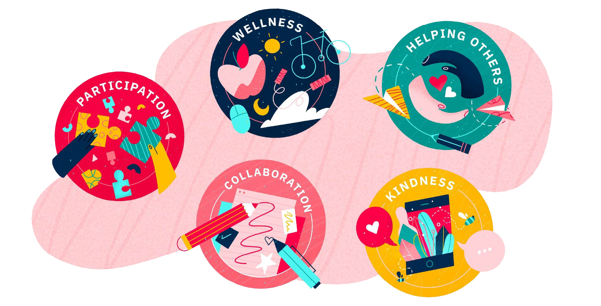

Recognition can provide supplemental extrinsic motivation to students in a positive and fun way. There are also free online tools that you can use to make personalized certificates. Teachers can send simple image files to students and announce via group chats or message boards who's received the certificates. Students can print their certificates at home and collect them, or take a photo of the certificates they're collecting.

<Row>
  <Column colMd={2} colLg={3}>

  </Column>
</Row>

## Certificates are an effective way to encourage connectedness and progress

<Row className="title-with-text">
  <Column colMd={2} colLg={3}>

## Select a certificate

  </Column>
  <Column colMd={6} colLg={8} className="certificates">

  </Column>
</Row>