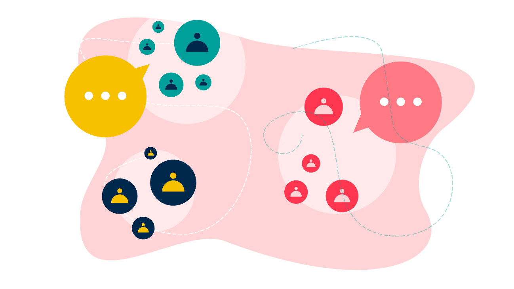

<Row className="title-with-text">
  <Column colMd={2} colLg={4}>

  </Column>
  <Column colMd={6} colLg={8}>

## How messaging platforms can help your classroom

Messaging platforms like [Cisco Webex Teams](https://www.webex.com/pricing/index.html) can help remote classrooms—similar to how they support remote and globally distributed teams at IBM.

Messaging platforms enable students and teachers to:

<ul>
<li>Chat, share information and answer questions with the entire class, small groups or individually</li>
<li>Share files and resources with the class</li>
<li>Hold multiple, topic-based conversations within a single class</li>
<li>Better align with the way students already converse digitally</li>
<li>Use emoji reactions for quick responses and engagement</li>
</ul>

These tools also integrate with other collaboration solutions (e.g., video conferencing, voice calls, file sharing).

  </Column>
</Row>
<Row className="title-with-text">
  <Column colMd={2} colLg={4}>

## Useful tips

  </Column>
  <Column colMd={6} colLg={8}>

We recommend the following tips for messaging with students:

<ul>
  <li>Upload a profile picture so students can better connect with the teacher and each other.</li>
  <li>Create spaces on Webex Teams for each of your classes. This keeps classroom discussions organized.</li>
  <li>Set your status to let others know if you are available, in a class, or offline.</li>
  <li>In Webex Teams, flag important content.</li>
</ul>

  </Column>
</Row>
<Row className="title-with-text">
  <Column colMd={2} colLg={3}>

## Cisco Webex Teams

  </Column>
  <Column colMd={4} colLg={6}>

[Cisco Webex Teams](https://www.webex.com/team-collaboration.html) offers unlimited messaging for free. Cisco has created resources, trainings and how-to guides to support IT, educators, staff and students. [Access the Webex Teams Quick Start Guide for Teachers](https://www.webex.com/content/dam/webex/eopi/assets/education/EducationK12TeacherWebexTeamsQSG.pdf). Learn about [Family Educational Rights and Privacy Act (FERPA) compliance](https://www.cisco.com/c/dam/en_us/solutions/industries/docs/education/guardian-privacy-security-faq.pdf) and the responsibility of the school district offering Cisco services to faculty and students.

  </Column>
  <Column colMd={2} colLg={3}>

  </Column>
</Row>

